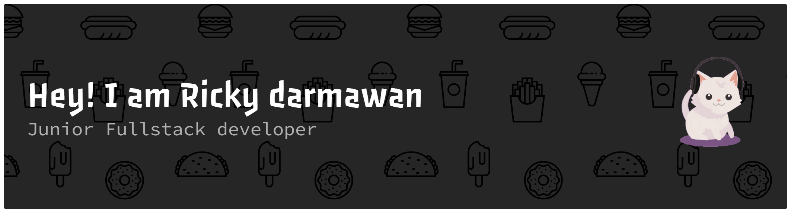

<div align="center">



<br/>

<!-- Typing - modern gradient style -->


<br/>

<!-- Modern gradient line -->


<br/>

<!-- Profile views + compact badges -->


</div>

<br/>

<table width="100%" align="center">
<tr>
<td width="50%" align="center">

###  About Me

</td>
<td width="50%" align="center">

###  Tech Stack

</td>
</tr>
<tr>
<td width="50%" valign="top">

```javascript
const profile = {
  name: "Ricky Darmawan",
  title: "Full Stack Developer",
  location: "Indonesia (GMT+7)",
  summary:
    "I build modern, reliable web apps with clean UI, solid APIs, and pragmatic engineering.",
  focus: [
    "Frontend: React / Next.js (performance, accessibility, UX)",
    "Backend: Node.js (REST APIs, auth, integrations)",
    "Data: PostgreSQL / MongoDB (schema design, query optimization)",
    "DevOps: Docker, CI/CD (repeatable builds & deployments)"
  ],
  highlights: [
    "Shipping production features end-to-end",
    "Maintaining clean, scalable codebases",
    "Collaborating with teams and stakeholders"
  ],
  currentlyLearning: ["System Design", "Cloud Fundamentals"],
  openTo: ["Freelance", "Remote", "Full-time"]
};
```

</td>
<td width="50%" valign="top" align="center">

<br/>

<!-- Modern skill icons - flat, colored -->
<p>
  
  
  
  
</p>
<p>
  
  
  
  
</p>
<p>
  
  
  
</p>

</td>
</tr>
</table>

<br/>

---

###  GitHub Stats

<div align="center">


</div>

<div align="center">


</div>

<br/>

---

###  Trophies

<div align="center">


</div>

<br/>

---

###  Let's Connect

<div align="center">

<a href="https://linkedin.com/in/rickydarmawan" target="_blank"></a>
<a href="https://twitter.com/rickydarmawan" target="_blank"></a>
<a href="https://rickydarmawan.dev" target="_blank"></a>
<a href="mailto:hello@rickydarmawan.dev"></a>

</div>

<br/>
<br/>

<div align="center">


</div>
